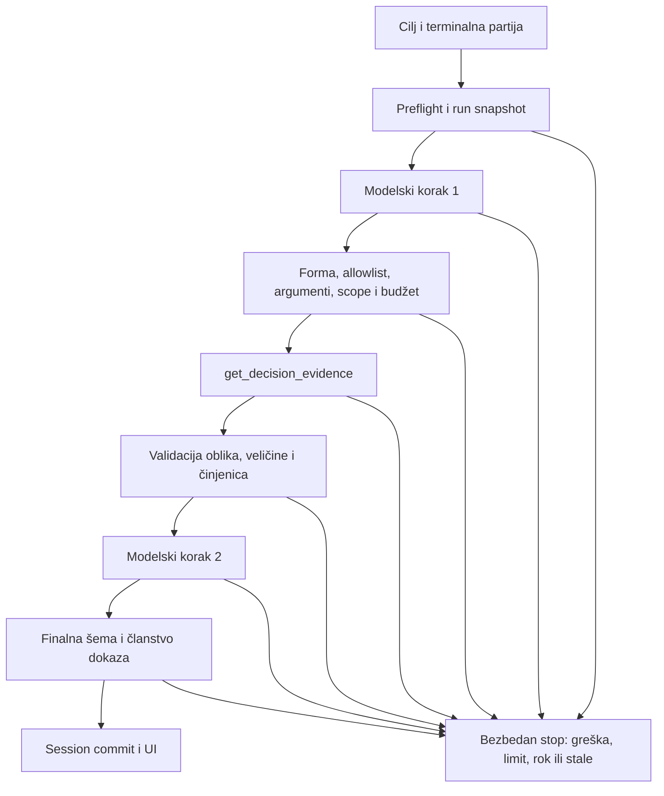

# Plan implementacije: Week05 bounded agent coach

Feature: `003-week05-bounded-agent-coach` · Datum: 2026-10-04.
Izvori: [spec](spec.md), [GAME_SPEC](../../docs/GAME_SPEC.md),
[tehnički ugovor](data-model.md), [HTTP ugovor](contracts/coach-http.md).
Ovo je plan; Week05 kod i testovi nisu implementirani ovim pregledom.

Aktuelni status 2026-10-05: plan je realizovan kroz T007–T023 i T024 offline provere.
Istorijska objašnjenja buduće implementacije ispod čuvaju ugovor; stvarni status je
u [taskovima](tasks.md) i [T024 handoff-u](../../docs/evidence/003-T024-handoff.txt).
T027 ljudska potvrda ostaje otvorena.
T030 dodaje smoke runner i stvarni live ishod; njegov insufficient_evidence stop
sam nije zatvorio live gate. T031 live #2 ga zatvara validiranim finalom 2/2/1,
read-only=true. [Aktuelni handoff](../../docs/evidence/003-T031-handoff.md).

## Cilj i tok

Nadograditi analizu jedne završene partije: ograničen cilj, modelski predlog jednog
read-only alata, provera predloga, izvršenje, provera tool rezultata, novi modelski
korak i validirani final. Week04 bot/analysis put ostaje funkcionalan.

## Constitution i tehnički kontekst

| Princip | Planirana provera |
|---|---|
| I Spec pre koda | T002–T006 dokumenti prethode T007 testovima. |
| II TDD | Behavior task prvo smisleni RED; dokumentacija samo sadržaj/link provere. |
| III Ispravnost domena | Pre/posle deep-equal poker state, RNG, istorija, facts. |
| IV Autoritet | Server veže snapshot i jedini bira executor. |
| V Ugovori | Strict runtime šeme i zasebna semantička provera. |
| VI Lokalni scope | Završena partija, postojeći provider, bez upisa ili infrastrukture. |
| VII Istiniti dokazi | Fake-first, stvarne komande; nepoznat doprinos/usage ostaje nepoznat. |

Postojeći package.json: TypeScript 6.0.3, Node 24, React 19.3.0, Fastify 5.12.5,
Zod 4.6.5, Vitest 5.0.1, Playwright 1.63.0, @google/genai 2.24.0.
Ne dodavati framework, biblioteku ili provider. Verzije su lokalni manifest,
ne tvrdnja o najnovijim verzijama na mreži.

Orchestrator je novi `backend/src/agent/` koordinator bez UI/HTTP/SDK/engine mutation
logike. Injektovati provider, monotoni sat, read-only executor i AbortSignal.
GameSession poseduje slot i serijski start/commit; await ne drži session lock.
Posebni coach POST/GET i DTO iz HTTP ugovora; bez coach polja u poker GameView-u.
Phase 3 izbor po korisničkom zahtevu: POST `/api/game/coach` i GET
`/api/game/coach/:runId`; nema konkurentnog query endpoint-a. T018–T020 backend
ne uvodi UI. Usage dobija additive strict `coach` agregat; stariji Week04 DTO bez
tog polja ostaje prihvaćen, ali backend ga uvek šalje.
UI koristi poseban coach prikaz ili proširen terminalni AnalysisPanel; lifecycle je
isti ugovor nezavisno od komponente. MatchFacts snapshot se projektuje/validira,
ne prosleđuje se ceo GameState ili repository.

## Zaključana politika T005

Status: početne vrednosti potvrđene 2026-10-04 nakon T004 provere. Ne menjaju se
poker pravila ni Week04 config/coordinator limiti. Brojke su dokumentacioni ugovor,
ne dokaz da runtime već poštuje limite.

| Granica | Vrednost i semantika |
|---|---|
| maxSteps | 2; stepCount raste neposredno pre prvog provider attempt-a novog logičkog koraka; retry ga ne povećava. |
| maxToolCalls | 1; toolCallCount raste neposredno pre ulaska u executor, i kada executor zatim padne. Odbijeni predlog ne povećava ga. |
| maxProviderAttempts | 4 ukupno za run, uključujući fallback i neuspeh; brojač raste neposredno pre slanja provider zahteva. |
| maxAttemptsPerStep | 2, najviše jedan retry ili fallback; postojeći config.maxAttempts=1 dodatno sužava na 1. |
| maxProviderFallbacks | Najviše 1 po koraku, ukupno 2; samo konfigurisani Week04 Gemini fallback model, nikad novi provider. |
| providerAttemptTimeoutMs | 15000 ili preostali run deadline, šta je manje; skriveni SDK retry isključen. |
| totalDeadlineMs | 45000 od prihvatanja preflight-a; obuhvata alat, validaciju, retry/backoff i commit. Monotoni sat je autoritet. |
| toolTimeoutMs | 1000 ili preostali rok; bounded kooperativni lokalni rad, bez ponovnog izvršenja. |
| tool input limit | Safe integer 1–10, focus mora odgovarati cilju. |
| maxToolResultBytes | 20480 bajtova JSON UTF-8 (20 KiB); broj odluka ≤argument ≤10. |
| Ostale veličine | HTTP input 1024 bajta; model context/candidate 32768 bajtova; final string/evidence granice iz data-model-a. |
| Retention | Jedan tekući/poslednji run po session-u, najviše 2 step/4 attempt/1 tool zapisa i 1 action key; cleanup na zamenu/restart. |

Dva koraka su minimalni korisni Core tok; jedan alat uklanja petlju izvršenja.
Četiri attempt-a daju po jednu priliku za recovery u oba koraka. 15 s / 45 s
omogućava drugi korak uz konačan rok: 4×15 s nije obećanje 60 s rada, zajednički rok
uvek pobedi. 20 KiB pokriva malu projekciju deset odluka; cap se proverava UTF-8
merenjem, ne brojem JS znakova. Nijedna početna vrednost nije promenjena.

### Retry i otklanjanje Week04 budžetnog nasleđivanja

Ne pozivati coordinateAnalysis dva puta sa novim lokalnim deadline-om/budžetom.
Coach ima jedan run-wide sat i attempt brojač, i provider-neutral poziv za svaki
attempt. Week04 klasifikacija i routing pravila su osnova, njegov 30 s analysisTotalMs
nije Week05 rok. Pre svakog attempt-a/retry/backoff-a proveriti signal, fingerprint,
step/attempt cap i remainingMs. Backoff koji ne staje u rok ne pokreće novi poziv:
wait/abort do ukupnog roka pa stopped/deadline. Deadline se ne obnavlja između koraka.

Auth/config, invalid_request, safety_refusal i poznata iscrpljena kvota ne retry-uju:
failed/provider_failed. Timeout, prolazni 429, transport/5xx: najviše jedan retry;
5xx može preći na unapred konfigurisani fallback. Backoff prati postojeću analysis
retry politiku (konfigurisani min/max, jitter 0–250 ms, Retry-After može ga produžiti),
uvek u zajedničkom roku. Ako 429 nema dovoljno podataka da razlikuje kvotu,
zabeležiti rate_limited bez pretpostavke. Malformed/schema/semantic predlog se
zaustavlja, bez korektivnog retry-ja; addendum dozvoljava stop. Posle izvršenog
alata retry koraka 2 koristi isti validirani tool result, nikada ne ponavlja korak 1
ili alat. Primer: step1 timeout+success, tool1, step2 success = 2 steps/3 attempts/1 tool.

### Stop ugovor i prioritet

| Razlog | Status / okidač |
|---|---|
| completed | completed; validan final sa completed=true i ≥1 proverljivom činjenicom |
| insufficient_evidence | stopped; prazan uzorak/rezultat, insufficient_context ili completed=false |
| invalid_input | stopped; nevažeći početni kontekst; HTTP preflight ga odbija bez provider/tool poziva |
| invalid_model_proposal | stopped; pogrešna vrsta koraka/rani final ili cannot_complete |
| unknown_tool | stopped; ime van allowlist-a, bez izvršenja |
| invalid_tool_arguments | stopped; strict args/focus/range/scope odbijeni |
| repeated_action | stopped; viđen canonical tool+args+factsRevision ključ, bez ponovnog izvršenja |
| tool_call_limit | stopped; nov tool request posle potrošenog tool budžeta |
| step_limit | stopped; novi modelski korak preko maxSteps |
| call_budget | stopped; pokušaj preko ukupnog attempt budžeta |
| deadline | stopped; monotoni zajednički rok istekao, abort svih čekanja |
| cancelled | stopped; reset/nova partija ili eksplicitni server abort |
| stale_state | stopped; fingerprint se promenio bez eksplicitnog cancellation-a |
| provider_failed | failed; terminalna provider greška ili iscrpljena 2 attempt-a koraka |
| tool_failed | failed; exception, timeout ili nevalidan rezultat alata |
| malformed_output | failed; JSON/strict schema/veličina ili final evidence validacija pada |

StopReason nije dodatni status; insufficient_evidence je razlog stopped statusa.
Bezbedna failureCategory dodatno razlikuje authentication_configuration,
quota_exhausted, rate_limit, provider_timeout, provider_unavailable,
provider_transport, provider_refusal, tool_timeout, tool_error, tool_validation,
invalid_structured_response, evidence_rejected, forbidden_scope; null za uspeh.
Nema sirovog tela ili exception-a. Time taxonomy razlikuje timeout od drugog kvara
bez promene osnovnih enum razloga.

Na async granici: već terminalno → bez promene; explicit abort → cancelled;
fingerprint mismatch → stale_state; istekao rok → deadline; tek onda rezultat/greška.
Za tool proposal: forma → allowlist → strict args/scope → repeated key → tool cap.
Repeated key ima prednost nad tool_call_limit u koraku 2, iako je maxToolCalls=1;
novi key tada daje tool_call_limit. Ne pokreće se korak 3 za proveru petlje:
step_limit testira koordinatorov guard pre pokušaja prelaska preko 2.
Canonical key: tool name + sortirani parsed JSON args + factsRevision; seen se upisuje
pre executor-a. Session i UI odbacuju late odgovor uz runId/gameId/handId/version/
factsRevision/request token; terminalni commit najviše jednom.

## Test i dokumentaciona strategija

T007/T008: unknown fields, diskriminanti, enum/range/string/byte granice i DTO.
T009–T011: svaki focus, deterministički izbor, 1/10 granice, UTF-8 cap, empty/aggregate,
foreign refs/factCode/canonical finding i nepromenjene činjenice.
T012–T017: scripted FakeAiProvider, kontrolisani sat/executor; success 2/1,
unknown/invalid args sa toolCallCount=0, invalid output, auth/429/5xx/timeout,
ponavljanje/step/tool/attempt cap, ukupni deadline kroz retry i drugi korak,
cancellation/stale/new-game, terminal commit najviše jednom, prompt injection podatak.
T018–T023: preflight 0 poziva, no-store, duplicate POST, dostupni GET tokom await-a,
UI status/retry/late response, tastatura i fake E2E uspeh + kontrolisan neuspeh.
T024–T027: najmanje 5 expected-first eval-a, postojeća Week04 regresija,
security/read-only review, stvarni evidence i doprinos oba člana.

Postojeće lokalne komande: `npm.cmd test`, `npm.cmd run typecheck`,
`npm.cmd run lint`, `npm.cmd run build`, `npm.cmd run test:e2e`.
Za baseline fokus izabrati postojeće AI analysis/adapter/http/smoke/concurrency,
contract/retry/context/usage testove i analysis/dashboard UI. Nije novi Week05 RED.
Live pozivi tek posle offline zelenog i eksplicitnog lokalnog opt-in-a; smernica do
15 razvojnih run-ova i 3 demo run-a. GAME_SPEC v1.2.1 usklađuje predaju sa assignment
§31: limited live demo je zaseban obavezni dokaz, van redovnih offline testova.

T030 (odobren 2026-10-05): `scripts/coach-smoke.ts` izvršava jedan sintetički terminalni
scenario kroz produkcione HTTP/session/orchestrator gate-ove. CLI
`scripts/gemini-coach-live-smoke.ts` bez `--live` ne učitava konfiguraciju niti pravi
provider; sa opt-in-om najviše jedan run, jedan attempt/step, bez fallback-a i najviše
dva generation poziva. CLI testovi koriste injected factory i fake provider.
Izlaz je allowlist projekcija: runId, goal, konfiguracioni model, status/stop reason,
step/attempt/tool brojači, latency, validacije i token metrics/unknown cost; nema
prompta, sirovog odgovora, karata, finding-a ili slobodnog model teksta.
Success traži 2/2/1, final validation, nepromenjen javni poker pogled i tool facts
snapshot. Potpun RNG/history/facts invariant dodatno pokriva prerequisite lifecycle
regresija; runner ne tvrdi pristup privatnom session stanju.
Neuspeh ostaje vidljiv uz exit 1; bez konfiguracije exit 2 i nula poziva; bez opt-in-a
exit 0 i nula poziva. Posle jednog live run-a nema automatskog ili ručnog ponavljanja
u ovom radu. Ljudski T027 i dalje zahteva zasebne potvrde.

`npm.cmd run smoke:coach` koristi kompajlirani `dist/server/scripts/` entrypoint
posle `npm.cmd run build`, bez tsx IPC zavisnosti. Node može učitati lokalni `.env`
u proces; bez flag-a nema resolve-a AI konfiguracije, provider konstrukcije/poziva.
T030 jedan live run je stvarno završen insufficient_evidence. T031: dogovoriti
informativniji sintetički scenario, dokazati ga offline, pa tek uz novo odobrenje
pokrenuti mali live demo. Iz sanitizovanog stop-a ne izvodi se da je mali uzorak
dokazan uzrok; to je hipoteza za sledeći scenario, bez slabljenja validatora.

T031 slice: `--scenario=street-review` bira lokalni fiksni driver call/check/check/
all_in kroz create/action HTTP rute, 4 odluke iz jedne ruke. Constructor fixture i
deck ostaju lokalni, bez produkcionog debug API-ja; expected stack oracle0/2000.
Default scenario je `single-all-in`; nepoznat/prazan/dupli scenario flag odbija se
pre dependencies factory-ja. Provider wrapper čuva samo count-e i projekciju
`CoachModelStepSchema` (kind, refusal enum ili final completed/evidenceCount), zatim
prosleđuje originalni nepoverljivi candidate postojećem orchestrator validatoru.
Tool wrapper beleži broj stvarnih decisions bez sadržaja. Metadata ne popravlja
predlog, ne prisiljava model na final i ne zamenjuje final membership proveru.
Test-first proveriti oracle/count/context/budget/read-only/privacy, pa relevantne
regresije/typecheck/lint/build. Tek zatim zatražiti korisnikov odgovor za live#2;
svaki naredni run takođe zahteva zasebno pitanje i redni broj.

## Putanje, artefakti i handoff

T002: spec/checklist; T003: plan/data-model/contracts; T004: originalni prompt i
CONTEXT_MANIFEST; T005: spec/plan/checklist/GAME_SPEC; T006: baseline i stvarni logovi.
Statusna izmena tasks.md je eksplicitno odobrena korisničkim zahtevom posle dokaza.
Za behavior sledećim članovima važe tačne task putanje T007+; ovaj razgovor ih ne menja.

Assignment §34 dozvoljava izbegavanje duplikata: spec.md pokriva feature spec,
ovaj dijagram agent flow, data-model.md tool contracts, budući evals.md eval-e.
EVIDENCE_W05.md i AI_USAGE_LOG se popunjavaju stvarnim runtime rezultatima u T026.

Jedan agent/urednik. A/B su predloženi driver-i; oba čoveka mogu nastaviti isti task.
Pre predaje pročitati task, deps, diff i dokaz prethodnog taska; zabeležiti stvarni
status, komande/exit, neizvršene provere i sledeći korak. Ne pripisivati review odsutnom
članu. Završeni dokumenti ne potvrđuju ljudsko razumevanje toka ili runtime kvalitet.

## T003 handoff

T002 provereno: matrica 25/25 i checklist semantika; neodređenosti su sada razrešene
u ovom planu/data-model/HTTP ugovoru. Pregled postojećih types/coordinator/retry-policy,
routes/session/MatchFacts i fake test helper-a određuje API ownership i granicu.
Komande: Get-Content, rg, git diff/status; npm provere nisu pokrenute za T003.
Sledeće: T004 prompt+manifest, zatim T005 sadržinski potvrditi ovu policy tabelu.

T032: samo CoachPanel, postojeći UI acceptance test i dokumenti/evidence. Jedan
live-region paragraph menja role status/alert prema stanju; bez duplog teksta.
Mapirati dve malformed failureCategory vrednosti u jasna objašnjenja, uz bezbedan
generički fallback. Opis selekcije prati focus, ne menja payload ili filtriranje.
RED→GREEN i coach UI/API/lifecycle, typecheck/lint/build. Bez novih live poziva.

T033: promena samo Gemini transporta koraka 2. Svaka činjenica u kopiji toolResult-a
dobija lokalni evidenceIndex, počevši od nule kroz decisions/facts redosled.
Transport final bira integer evidence listu, adapter validira strict oblik i
indekse, zatim prenosi kanonske stavke iz izvornog request-a. Šema traži final ili
refusal; neutralni provider ugovor, DTO i završni validator ne menjaju se.
Postojeće byte granice važe i za obogaćeni transportni kontekst. Bez dupliranja
finding-a, fallback dopunjavanja, dodatnog retry-ja ili promene budžeta/igre.
TDD: offline SDK stub + read-only orchestrator integration, negativni indeksi,
duplikati i unknown fields; agent/Gemini regresija, typecheck/lint/build.
Tačno neispravno polje istorijskog run-a ostaje unknown; live provera nije pokrenuta.
## T034/T035 — execution plan

Primeniti pregledani003-T034-prepared.patch tek nakon novog odobrenja korisnika
(dato2026-10-06); ponoviti119fokus/typecheck. T035 proširuje postojeći smoke runner
sa strict --focus enum flagom i uvodi bounded batch runner/rate gate. CLI ledger
beleži samo count/model/dispatch vremena/safe report. Maksimum50requests,6000ms
razmak, bez SDK retry/fallback-a, sintetički constructor fixture u in-process HTTP.
Prva baseline batch6run-ova=do12requests (3focus×2scenario), zatim adaptivni testovi
i holdout za realne pronađene greške; ne mora se potrošiti ceo odobreni budžet.
Opšti live DoD ne tvrdi odsustvo svih grešaka ili stratešku optimalnost. Runtime
validator/read-only/budžeti ostaju, samo dokumentovano poboljšanje i precizna dijagnoza.
Svi novi task-source/test/evidence putevi uT035. Jedan agent, bez subagenata.

Konačna primena: T034119/119potvrđen u stvarnom projektu. Detaljna dijagnostika
uhvatila invalid_kind; T035 menja string/number const u singleton enum samo u
Gemini šemi oba koraka, uz immutable neutralni schema input i strict runtime
validaciju. Ista matrica9run-ova pre/posle:7/9→9/9. Ukupno48zahteva; gate
6000ms,0retry/fallback,0rate/timeouts. Long-match3ruke/12odluka nezavisan je holdout.
Puna regresija888/888, typecheck/lint/build0. Browser E2E nije ponovljen; korisnički
dev port je zauzet. [Konačni handoff](../../docs/evidence/003-T035-handoff.md).

## T036 — plan stabilizacije Vitest-a, 2026-10-07

Korisnik odobrava samo tačku 1 na zajedničkoj grani za buduće review popravke.
Signal nezavisnog pregleda: 877 prolaza uz worker-start grešku, uključujući
single-worker pokušaj. Uzrok još nije poznat. Lokalni prethodni dokaz je 888/888.
Prvo zabeležiti neizmenjenu punu proveru i okruženje, zatim po nalazu proveriti
projekat/pool/startup i cleanup. Test ponašanja proizvoda se ne menja radi runner-a.
Ako se menja samo konfiguracija, postojeća puna suite je pre/posle oracle;
infrastrukturni neuspeh nije izmišljeni behavior RED. Završni kriterijum su tri
uzastopna puna exit-0 run-a bez grešaka runner-a, isti obuhvat i statičke provere.
Istorijski kvar koji nije reprodukovan ostaje jasno ograničenje. E2E i CI su van
ovog taska; nema provider poziva, novih dependencies ili automatskog Git publish-a.

T036 dijagnostika: neizmenjeni full888/888, Node781/781 i UI107/107 prolaze.
Instalirani Vitest5.0.1 resolveMaxWorkers bez konfiguracije koristi CPU-1,
ovde15; worker-start rok je poseban interni90s, nije testTimeout. CLI proba
maxWorkers=4 daje888/888. Minimalna izmena je zajednički cap
Math.min(4, availableParallelism()) u vitest.config.ts. Pool/fajl izolacija,
timeout-i, retry i skup testova ostaju isti. Ovo je preventivno ograničenje
resursa, ne potvrđen uzrok istorijskog pada (single-worker nalaz ga ne dokazuje).
